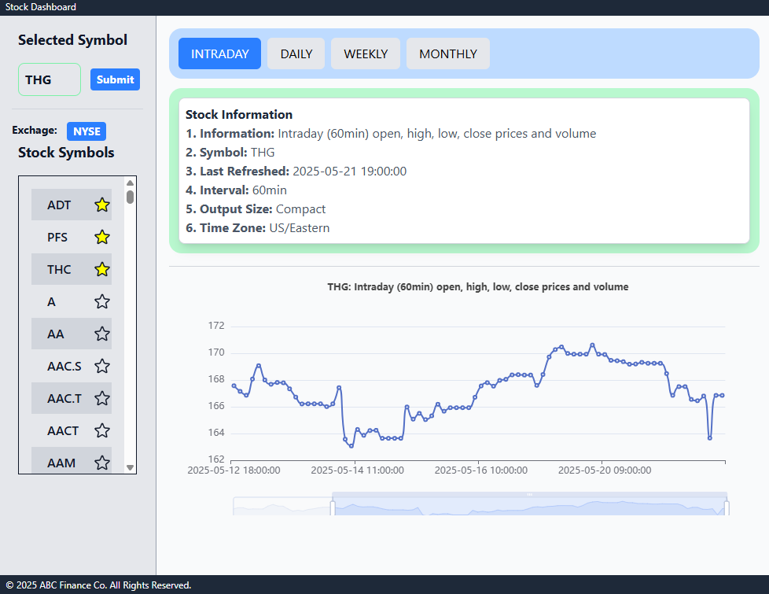
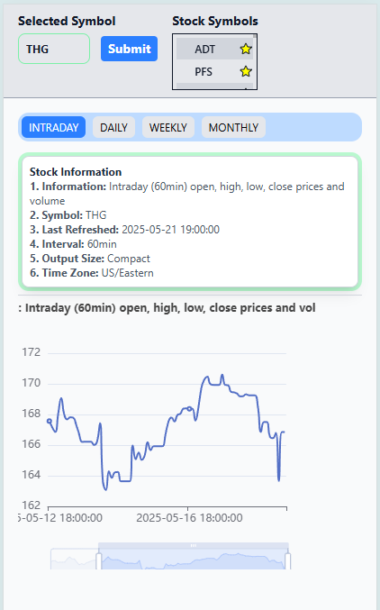

<!--
  README – jericrealubit/stock-dashboard
  Last update: 2024--
-->

<h1 align="center">
  📈 Stock Dashboard
</h1>

<p align="center">
  Real-time market data, interactive charts, and simple portfolio tracking — all in one lightweight Vue 3 web app.
</p>

<p align="center">
  <!-- Adjust the badge URLs once your workflow / license is final -->
  <a href="https://github.com/jericrealubit/stock-dashboard/actions">
    
  </a>
  <a href="https://github.com/jericrealubit/stock-dashboard/issues">
    
  </a>
  <a href="https://github.com/jericrealubit/stock-dashboard/blob/main/LICENSE">
    
  </a>
</p>

---

## ✨ Features

- 🔍 **Symbol Search** – fetch live quotes for any ticker.
- 🕰️ **Intraday & Historical Charts** – powered by ECharts.
- 📰 **News Feed** – headline stream for the active symbol.
- 🎛️ **Technical Indicators** – moving averages, Bollinger Bands, RSI.
- 📊 **Portfolio Tracker** – add positions, monitor P/L.
- 🌚 **Dark / Light Themes** – Tailwind CSS v4 colour modes.
- ⚡ **Blazing Fast** – Vue 3 + Vite 6 + ES modules.

_(Comment out bullets that are not yet implemented.)_

---

## 🖼️ Screenshots

| Desktop                                              | Mobile                                              |
| ---------------------------------------------------- | --------------------------------------------------- |
|  |  |

---

## 🔧 Tech Stack

| Layer               | Package / Version                                      |
| ------------------- | ------------------------------------------------------ |
| Front-end Framework | **Vue 3** (`vue@^3.5.13`)                              |
| Build Tool          | **Vite 6** (`vite@^6.2.4`)                             |
| State Management    | **Pinia 3** (`pinia@^3.0.2`)                           |
| Charts              | **ECharts 5** (`echarts@^5.6.0`, `vue-echarts@^7.0.3`) |
| HTTP Client         | **Axios 1** (`axios@^1.9.0`)                           |
| CSS Framework       | **Tailwind CSS 4** (`tailwindcss@^4.1.4`)              |
| Mock API / Fixtures | **json-server 1** (`json-server@^1.0.0-beta.3`)        |
| Dev Experience      | `@vitejs/plugin-vue`, `vite-plugin-vue-devtools`       |
| Formatting / Lint   | **Prettier 3**                                         |

_(Versions pulled directly from `package.json`.)_

---

## 🚀 Live Demo

<!-- Replace with actual URL once deployed -->

A hosted build is available at **https://stock-dashboard.example.com**.

---

## 🛠️ Prerequisites

1. Node.js ≥ 18 (LTS recommended)
2. `npm` ≥ 9 / `pnpm` ≥ 8 / `yarn` ≥ 1.22
3. (Optional) API key(s) from your chosen market-data providers.

---

## 🏁 Quick Start

```bash
# 1) Clone
git clone https://github.com/jericrealubit/stock-dashboard.git
cd stock-dashboard

# 2) Install dependencies
npm install          # or pnpm install / yarn install

# 3) Create environment variables
cp .env.example .env   # then fill in API_KEY=...

# 4) Start dev server
npm run dev

# 5) Visit http://localhost:3000

stock-dashboard/
 ├─ public/                # Static assets
 ├─ src/
 │   ├─ assets/            # Images / icons
 │   ├─ components/        # Re-usable UI blocks
 │   ├─ layouts/           # App shells
 │   ├─ pages/             # Route components (Vue Router)
 │   ├─ stores/            # Pinia stores
 │   ├─ services/          # API helpers (Axios)
 │   ├─ styles/            # Tailwind base / utilities
 │   ├─ router/            # Vue-Router config
 │   └─ main.ts            # App entry point
 ├─ mock-api/              # json-server db & routes
 ├─ tests/                 # Vitest / Cypress etc.
 ├─ .env.example
 └─ vite.config.ts

 Made with ❤️ by @jericrealubit
```
